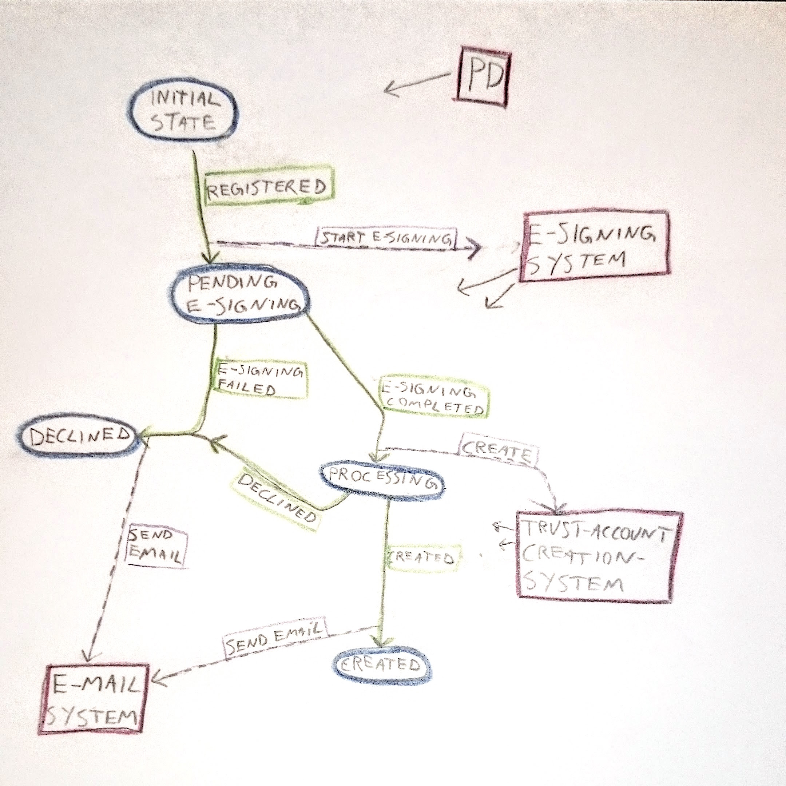

example
==============================

This folder contains some working runnable example-projects (With tests also).

Example 1 - Booking
-----------------------------

This example is pretending to be a simple booking-application:

* A Booking can be opened
* You can reserve a seat
** Which prints the ticket
* You can canel a seat
* The booking can be closed
** A notification to the cinema is sent.

([Example-runner-code](aggregates/src/main/scala/no/nextgentel/oss/akkatools/example/))
([eventsourcing-code](aggregates/src/main/scala/no/nextgentel/oss/akkatools/example/booking/))
([tests](aggregates/src/test/scala/no/nextgentel/oss/akkatools/example/))

Example 2 - Trust Account creation
-----------------------------

This example is pretending to be a system used to handle the process
of creating a Trust Account.

It communicates with the following "external systems":

* E-Signing system
* E-mail system
* Trust Account Creation System

This diagram explains the state- and flow- of the process:

([Example-runner-code](aggregates/src/main/scala/no/nextgentel/oss/akkatools/example2/))
([eventsourcing-code](aggregates/src/main/scala/no/nextgentel/oss/akkatools/example2/trustaccountcreation/))
([tests](aggregates/src/test/scala/no/nextgentel/oss/akkatools/example2/))
